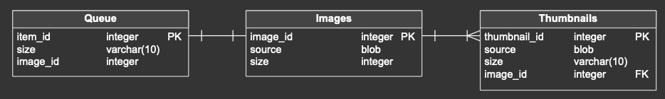

# Changelog

## 12.12.2023

### Database

- Created database diagram 

- Created Enum that defines thumbnail sizes
    ```Java
    public enum ThumbnailSize {
        SMALL(300),
        MEDIUM(500),
        LARGE(800);

        private int size;
        private ThumbnailSize(int size){
            this.size = size;
        }
        public int getSize(){
            return size;
        }
    }
    ```
- Created classes according to diagram:
    - Image
    ```Java
    @Entity
    public class Image {
        @Id
        @GeneratedValue
        private int image_id;
        private byte[] source;
        private int size;
        @OneToMany
        private List<Queue> Queue;
        @OneToMany
        private List<Thumbnail> Thumbnails;

        public Image(byte[] source, int size){
            this.source = source;
            this.size = size;
            this.Queue = new ArrayList<>();
            this.Thumbnails = new ArrayList<>();
        }

        public Image(){
        }

        public int getImage_id(){
            return image_id;
        }

        public byte[] getSource() {
            return source;
        }

        public int getSize(){
            return size;
        }

        public List<Queue> getQueue(){
            return Queue;
        }

        public List<Thumbnail> getThumbnails(){
            return Thumbnails;
        }

        public void addToQueue(Queue queueItem){
            Queue.add(queueItem);
        }

        public void addThumbnails(Thumbnail thumbnail){
            Thumbnails.add(thumbnail);
        }
    }
    ```
    - Queue
    ```Java
    @Entity
    public class Queue {
        @Id
        @GeneratedValue
        private int item_id;
        private ThumbnailSize size;
        @ManyToOne
        private Image image;

        public Queue(ThumbnailSize size, Image image){
            this.size = size;
            this.image = image;
        }

        public Queue(){
        }

        public int getItem_id(){
            return item_id;
        }

        public ThumbnailSize getSize() {
            return size;
        }

        public Image getImage(){
            return image;
        }
    }
    ```
    - Thumbnail
    ```Java
    @Entity
    public class Thumbnail {
        @Id
        @GeneratedValue
        private int item_id;
        private byte[] source;
        private ThumbnailSize size;
        @ManyToOne
        private Image image;

        public Thumbnail(byte[] source, ThumbnailSize size, Image image){
            this.source = source;
            this.size = size;
            this.image = image;
        }

        public Thumbnail(){
        }

        public int getItem_id(){
            return item_id;
        }

        public byte[] getSource() {
            return source;
        }

        public ThumbnailSize getSize() {
            return size;
        }

        public Image getImage(){
            return image;
        }
    }
    ```